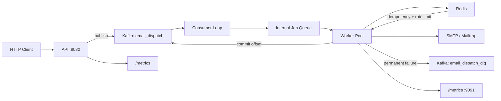

# Notification Service

Event-driven email notification platform built in Go. Campaigns are accepted over HTTP, queued in Kafka, processed asynchronously by worker pools, coordinated through Redis, and delivered via SMTP—with retries, a dead letter queue (DLQ), structured logging, and Prometheus metrics.

## Project Overview

This service decouples **campaign intake** from **email delivery**:

1. The **API** validates a campaign request and publishes one Kafka message per recipient.
2. **Kafka** buffers work and provides at-least-once delivery to consumers.
3. A **consumer goroutine** fetches messages and hands them to an internal buffered channel.
4. **Worker goroutines** claim jobs in Redis (idempotency), pass a global rate limiter, send email over SMTP, and commit offsets—or route permanent failures to the DLQ.

Redis provides **distributed idempotency** (SETNX per `job_id`) and a **fixed-window rate limiter** (1 send/second globally in the current configuration).

## Architecture




## Features


| Feature                   | Description                                               |
| ------------------------- | --------------------------------------------------------- |
| Async processing          | API returns `202 Accepted` after Kafka enqueue            |
| Worker pool               | Configurable goroutines draining an internal queue        |
| Kafka retries             | Producer retries transient broker errors                  |
| Redis idempotency         | `SETNX` per job ID with 24h TTL                           |
| Claim release             | Failed/incomplete jobs release claims for redelivery      |
| Distributed rate limiting | Per-second counter in Redis                               |
| DLQ                       | Permanent SMTP failures published to `email_dispatch_dlq` |
| SMTP retry                | 3 attempts with 2s / 4s / 8s backoff on transient errors  |
| Error classification      | Transient vs permanent SMTP heuristics                    |
| Structured logging        | JSON `slog` with `worker_id`, `job_id`, etc.              |
| Prometheus metrics        | Counters, histograms, gauges on API and worker            |
| Graceful shutdown         | Signal handling, context cancel, channel drain            |
| Poison pills              | Malformed JSON committed and skipped                      |


## Tech Stack

- **Go** 1.25+
- **Apache Kafka** (segmentio/kafka-go)
- **Redis** 7 (go-redis)
- **SMTP** (go-mail / Mailtrap)
- **Prometheus** client_golang
- **log/slog** structured logging
- **Docker Compose** (Zookeeper, Kafka, Redis)

## Folder Structure

```
cmd/
  api/          HTTP gateway, campaign launch, metrics
  worker/       Kafka consumer, worker pool, metrics server
internal/
  broker/       Kafka producer, consumer, DLQ
  cache/        Redis idempotency + rate limiter
  mailer/       SMTP client, templates, error classification
  worker/       Job processing pipeline
  models/       Request/job/DLQ types
  metrics/      Prometheus registry
  logging/      slog initialization
templates/      HTML email templates (whitelisted)
docker-compose.yml
```

## Local Setup

### Prerequisites

- Go 1.25+
- Docker Desktop (or Docker Engine + Compose)
- Mailtrap (or other SMTP) credentials

### 1. Start infrastructure

```powershell
docker compose up -d
```

Services: Zookeeper `:2181`, Kafka `:9092`, Redis `:6379`.

### 2. Configure environment

```powershell
Copy-Item .env.example .env
# Edit .env with Mailtrap SMTP credentials
```

### 3. Run the API

```powershell
go run ./cmd/api
```

Listens on `http://localhost:8080`.

### 4. Run workers

```powershell
go run ./cmd/worker
```

Metrics on `http://localhost:9091/metrics` by default.

### Environment variables


| Variable         | Default          | Description                     |
| ---------------- | ---------------- | ------------------------------- |
| `SMTP_HOST`      | —                | SMTP server host                |
| `SMTP_PORT`      | —                | SMTP port                       |
| `SMTP_USERNAME`  | —                | SMTP user                       |
| `SMTP_PASSWORD`  | —                | SMTP password                   |
| `KAFKA_BROKERS`  | `localhost:9092` | Comma-separated brokers         |
| `KAFKA_TOPIC`    | `email_dispatch` | Dispatch topic                  |
| `KAFKA_GROUP_ID` | `email-senders`  | Consumer group                  |
| `REDIS_ADDR`     | `localhost:6379` | Redis address                   |
| `METRICS_ADDR`   | `:9091`          | Worker metrics listen addr      |
| `LOG_LEVEL`      | `info`           | Set to `debug` for verbose logs |


## API Usage

### Launch campaign

```powershell
Invoke-RestMethod -Method POST `
  -Uri "http://localhost:8080/api/campaign/launch" `
  -ContentType "application/json" `
  -Body (@{
    campaign_id = "spring-2026"
    template_id = "welcome"
    audience_id = "beta-users"
    subject     = "Welcome aboard"
  } | ConvertTo-Json)
```

**Allowed `template_id` values:** `welcome`, `early_access`, `newsletter`

**Sample response** (`202 Accepted`):

```json
{
  "status": "Campaign Accepted",
  "message": "Queued 3 emails for processing"
}
```

## Metrics


| Service | Endpoint                        |
| ------- | ------------------------------- |
| API     | `http://localhost:8080/metrics` |
| Worker  | `http://localhost:9091/metrics` |


### Key metrics


| Metric                           | Type      | Meaning                     |
| -------------------------------- | --------- | --------------------------- |
| `emails_sent_total`              | Counter   | Successful SMTP sends       |
| `emails_failed_total`            | Counter   | Permanent SMTP failures     |
| `smtp_retry_total`               | Counter   | Backoff retries             |
| `kafka_fetch_errors_total`       | Counter   | Consumer fetch retries      |
| `redis_errors_total`             | Counter   | Redis failures              |
| `rate_limit_hits_total`          | Counter   | Rate limit denials          |
| `poison_pill_total`              | Counter   | Bad Kafka payloads          |
| `dlq_publish_total{result}`      | Counter   | DLQ publish success/failure |
| `smtp_send_duration_seconds`     | Histogram | SMTP latency                |
| `kafka_publish_duration_seconds` | Histogram | Publish latency             |
| `active_workers`                 | Gauge     | Worker goroutines           |
| `queued_jobs`                    | Gauge     | Internal queue depth        |


Scrape with Prometheus or inspect manually:

```powershell
curl http://localhost:9091/metrics
```

## DLQ Usage

When SMTP returns a **permanent** error (e.g. mailbox not found, 550/551/553/554):

1. A `DLQMessage` is published to `email_dispatch_dlq` (original job, error, timestamp, retry count).
2. The dispatch topic offset is committed **only after** a successful DLQ publish.

Inspect DLQ messages:

```powershell
docker exec -it kafka kafka-console-consumer `
  --bootstrap-server localhost:9092 `
  --topic email_dispatch_dlq `
  --from-beginning
```

## Reliability Guarantees


| Guarantee                 | Behavior                                                                                |
| ------------------------- | --------------------------------------------------------------------------------------- |
| **At-least-once (Kafka)** | Offsets commit after success or terminal handling; transient failures are not committed |
| **Idempotency**           | Redis `SETNX` per `job_id`; duplicates commit and skip send                             |
| **Claim release**         | Incomplete processing releases the Redis key so redelivery can retry SMTP               |
| **SMTP retries**          | Up to 3 attempts; transient errors backoff 2s / 4s / 8s                                 |
| **Permanent failures**    | DLQ + commit; no infinite SMTP retry                                                    |
| **Poison pills**          | Unmarshal errors: commit and skip (no DLQ)                                              |


**Not guaranteed:** exactly-once email delivery. A successful send with a failed Kafka commit retains the idempotency claim to avoid duplicate emails; ops must reconcile stuck offsets.

## Future Improvements

- Kafka **partitions** and keyed consumption for horizontal scale
- Dedicated **retry topic** instead of only consumer redelivery
- **Outbox pattern** for API→Kafka atomicity with a database
- **Kubernetes** deployments, health probes, HPA
- **Grafana** dashboards + alert rules
- **OpenTelemetry** traces linking API → Kafka → worker → SMTP
- **CI/CD** pipeline (lint, test, image build)
- Per-tenant rate limits and configurable SMTP circuit breakers
- DLQ **reprocessing** consumer

## Development

```powershell
go test ./...
go build ./...
```

## License

Practice / portfolio project.